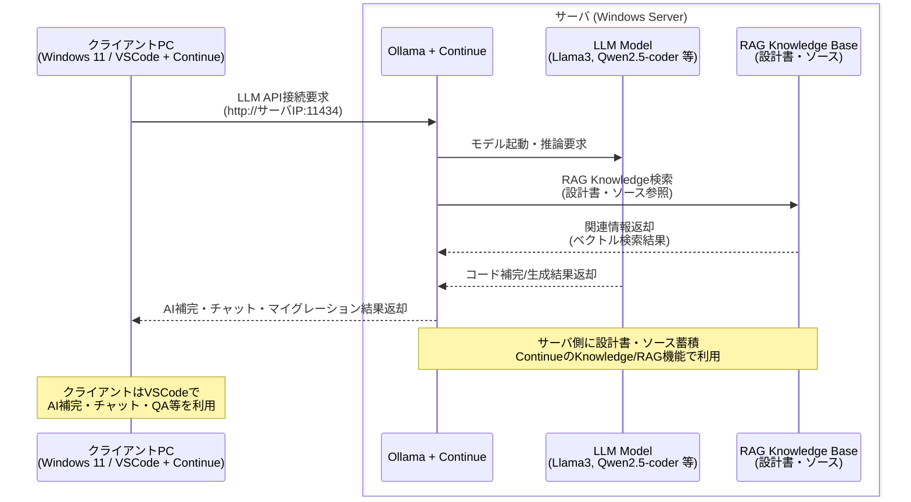

## 概要

このガイドでは、Windows Server（2016/2022）上に Ollama を立て、Continue を連携してRAG（Retrieval-Augmented Generation）を実運用レベルで利用する手順をまとめます。クライアントは Windows 11 上の VSCode＋Continue 拡張を利用して、サーバに蓄積した設計書やソースを参照しながらAI支援を行います。



## 1. サーバ側（Windows Server 2016/2022）

### (1) 推奨スペックと前提

- 推奨: RAM 16GB 以上、CPU 4コア以上
- GPU があれば応答速度が大幅に向上（NVIDIA, VRAM 8GB 以上推奨）
- 管理者（Administrator）権限で作業すること

### (2) Ollama のインストール

1. Ollama の Windows インストーラーをダウンロード
2. インストーラーを右クリック → 管理者として実行
3. インストール後、コマンドプロンプトでバージョン確認:

```powershell
ollama --version
```

### (3) モデルの準備

- 利用するモデルをサーバに pull しておきます。例:

```powershell
ollama pull llama3:8b
ollama pull qwen2:7b
```

- コード生成特化モデル（例: Qwen2.5-coder）を加えると開発支援が強化されます。

### (4) サーバ公開設定（LAN/社内限定を推奨）

- デフォルトは localhost:11434。外部（LAN）からアクセスさせる場合は以下を設定します。
  - Windows ファイアウォールで TCP 11434 を許可
  - 環境変数で `OLLAMA_HOST=0.0.0.0` を設定して全インターフェースで待ち受け

起動例:

```powershell
set OLLAMA_HOST=0.0.0.0
ollama serve
```

- サーバのプライベートIP（例: 192.168.1.10）を控えておきます。

### (5) Continue のインストールと設定

1. Continue バイナリをダウンロード（または npm 経由でインストール）
2. Continue の設定ファイル（`continue/config.yaml`）例:

```yaml
models:
  - provider: ollama
    name: llama3
    api_base: http://0.0.0.0:11434

knowledge:
  - path: ./docs/
  - path: ./src/
```

3. Continue を起動して API を利用可能にします。

### (6) RAG 用データの蓄積

- 設計書、仕様書、マニュアルを `docs/` に、ソースを `src/` に配置
- 大量のドキュメントを扱う場合はベクトル DB（ChromaDB、Milvus など）を導入して検索性能を向上させることを検討

## 2. クライアント側（Windows 11）

### (1) VSCode の準備

- VSCode をインストールし、最新の状態にしておきます。

### (2) Continue 拡張の導入

- VSCode の拡張マーケットプレイスから「Continue」をインストール
- サイドバーに Continue のパネルが追加されます

### (3) Ollama 接続設定（クライアント）

- VSCode の Continue 設定で `config.yaml` を編集し、サーバの IP を指定:

```yaml
models:
  - provider: ollama
    name: llama3
    api_base: http://192.168.1.10:11434
```

- Knowledge をクライアント側でローカル参照にするか、サーバ側の Continue を経由するかは用途に応じて選択可能

## 3. RAG（設計書・ソース蓄積）運用のポイント

### (1) データ配置と更新フロー

- `docs/` にMarkdown/PDF を置き、更新は PR ベースまたはSCP/SMB で行う運用が現実的
- ソースは Git で管理し、タグやリリースに合わせて Knowledge を再インデックス

### (2) Continue Knowledge の再インデックス

- 新しいドキュメントを追加したら、Knowledge の再インデックスを走らせる（手動 or 定期バッチ）
- 大量更新時は差分インデックスを導入すると効率的

### (3) VSCode でのワークフロー

- Continue のサイドバーでチャットやQA、コード補完を利用
- ファイル単位でRAG参照を限定し、誤誘導を抑える設定を推奨

## 4. セキュリティと運用の注意点

- 公開は原則社内VPN 内に留め、インターネット公開時は認証・TLS・IP 制限を必須
- API キーや管理者パスは安全に管理。ログ収集で不審なアクセスを検知
- モデルのバージョン管理と推論コストの監視を行う

## 5. 応用と拡張

- ベクトルDB を導入して検索精度を向上
- 複数モデル（会話用・コード用）を切り替え運用
- CI/CD に組み込み、ドキュメント更新で自動再インデックス

## まとめ

この手順で、Windows Server 上に Ollama と Continue を構築し、VSCode クライアントから LAN 経由で RAG を活用する実運用が可能です。
